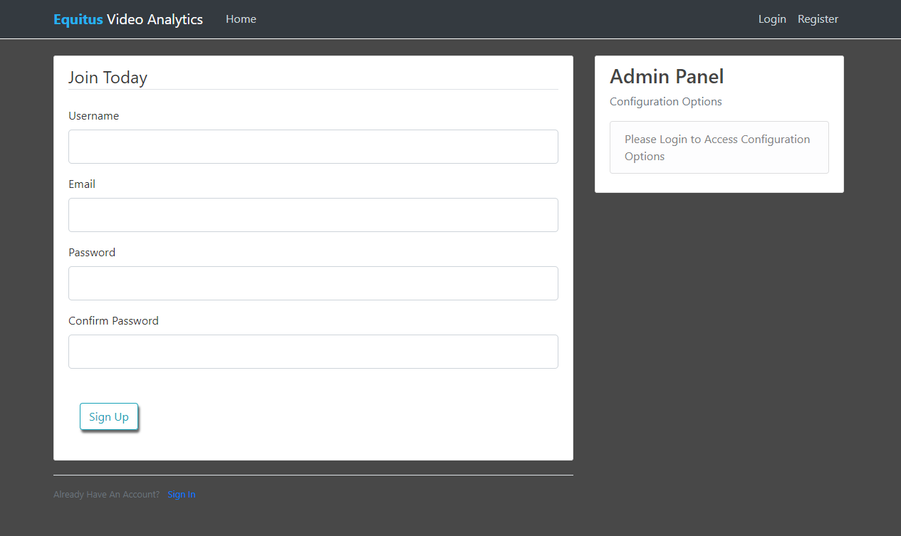

# Tensorflow Model Testing Webapp

This is a flask webapp for testing tensorflow models. It uses opencv to stream the processed video and draw boxes around the objects you have defined for detection.

It's designed for a use case where you develop your models and write code on a local machine, but your GPU compute is done on a headless remote server. To use it, I recommend using an RTSP stream link, although local files and webcams are also supported, provided they are on the remote server. To use a webcam local to the server, type 0 in the rtsp link. For local files, give the full path.

It's a stripped down version of a more fully-featured video analytics system, currently a private repo. Please open an issue for any code that doesn't appear to do anything.

